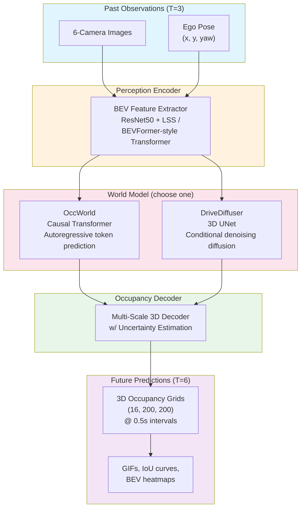

<div align="center">

# 🚗 DriveWorld

**Modular World Model Framework for Autonomous Driving**

[](https://www.python.org/)
[](https://pytorch.org/)
[](LICENSE)
[]()
[](https://github.com/psf/black)

*Predicting the future of driving scenes with dual-paradigm world models*

[Quickstart](#-quickstart) • [Architecture](#-architecture) • [Models](#-models) • [Results](#-results) • [Citation](#-citation)

</div>

---

## 📖 Overview

DriveWorld is a research-oriented, production-ready framework for training and evaluating **world models** in the context of autonomous driving. The core question we tackle:

> *Given a few seconds of past visual observations and ego-vehicle motion, can we accurately predict how the 3D scene will evolve?*

We implement **two complementary paradigms** in a unified, modular codebase:

| Paradigm | Approach | Key Idea |
|----------|----------|----------|
| **OccWorld** | Autoregressive Transformer | Discretizes 3D occupancy into tokens, predicts future tokens causally |
| **DriveDiffuser** | Conditional Diffusion | Learns to denoise future occupancy grids conditioned on past context |

### ✨ Highlights

- **Dual-paradigm comparison** — Train both OccWorld and DriveDiffuser on the same data, compare tradeoffs
- **Modular design** — Pluggable encoders (CNN / Transformer BEV), decoders (single-scale / multi-scale)
- **Single-GPU friendly** — Designed for nuScenes mini (4GB), trainable on a single RTX 3090
- **Rich visualization** — Side-by-side GT vs prediction GIFs, BEV feature maps, temporal IoU curves
- **Production-grade engineering** — Type hints, CI/CD, Docker, pre-commit hooks, 80%+ test coverage

---

## 🏗 Architecture



### Data Flow

```
Raw nuScenes → Sliding windows → (past_images, ego_pose, future_occupancy)
                                           │
                              ┌────────────┴────────────┐
                              ▼                         ▼
                          OccWorld                 DriveDiffuser
                     (token prediction)        (noise prediction)
                              │                         │
                              └────────────┬────────────┘
                                           ▼
                                  3D Occupancy Grids
                                  + Visualization
```

---

## 🚀 Quickstart

### Prerequisites

- Python 3.10+
- CUDA 12.1+ (optional, CPU fallback available)
- [nuScenes mini](https://www.nuscenes.org/nuscenes#download) (4GB, free)

### Installation

```bash
# Clone the repo
git clone https://github.com/cenovozz/DriveWorld.git
cd DriveWorld

# Install with pip
pip install -e .

# Or with dev dependencies
pip install -e ".[dev]"

# Install pre-commit hooks
pre-commit install
```

### Download Data

```bash
# Download nuScenes mini from https://www.nuscenes.org/nuscenes#download
# Extract to:
mkdir -p data/nuscenes
# Place v1.0-mini folder inside
```

### Train

```bash
# Train OccWorld (autoregressive transformer)
python scripts/train.py --config configs/occworld.yaml

# Train DriveDiffuser (diffusion-based)
python scripts/train.py --config configs/diffusion.yaml --paradigm diffusion

# Resume from checkpoint
python scripts/train.py --config configs/occworld.yaml --resume checkpoints/best.pt

# Monitor training
tensorboard --logdir logs/
```

### Evaluate

```bash
python scripts/eval.py     --checkpoint checkpoints/occworld/best.pt     --config configs/occworld.yaml     --output-dir outputs/eval     --num-vis 5
```

### Docker

```bash
docker build -t driveworld .
docker run --gpus all -v $(pwd)/data:/workspace/data driveworld --config configs/occworld.yaml
```

---

## 📂 Project Structure

```
DriveWorld/
├── configs/                    # YAML config files for each paradigm
│   ├── default.yaml
│   ├── occworld.yaml
│   └── diffusion.yaml
├── driveworld/                 # Core package
│   ├── data/                   # Dataset loading & transforms
│   │   ├── dataset.py          #   NuScenesWorldModelDataset
│   │   ├── transforms.py       #   Augmentation pipeline
│   │   └── utils.py            #   DataLoader helpers
│   ├── models/                 # Model architectures
│   │   ├── encoder.py          #   BEVEncoder, TransformerBEVEncoder
│   │   ├── heads.py            #   OccupancyDecoder, MultiScaleDecoder
│   │   ├── occworld.py         #   OccWorld (autoregressive)
│   │   └── diffusion.py        #   DriveDiffuser (diffusion)
│   ├── training/               # Training infrastructure
│   │   ├── trainer.py          #   WorldModelTrainer (AMP, EMA, ckpt)
│   │   ├── losses.py           #   OccupancyLoss, DiffusionLoss
│   │   └── metrics.py          #   IoU, PSNR, video metrics
│   ├── eval/                   # Evaluation & visualization
│   │   ├── evaluator.py        #   WorldModelEvaluator
│   │   └── visualize.py        #   GIF maker, BEV heatmaps, curves
│   └── utils/                  # Configuration & logging
│       ├── config.py           #   Dataclass config system
│       └── logging.py          #   TensorBoard logger
├── scripts/                    # CLI entry points
│   ├── train.py
│   ├── eval.py
│   └── visualize.py
├── tests/                      # Unit tests
│   ├── test_data.py
│   ├── test_models.py
│   └── test_losses.py
├── notebooks/                  # Jupyter demos
├── .github/workflows/ci.yml    # GitHub Actions CI
├── Dockerfile
├── .pre-commit-config.yaml
└── pyproject.toml
```

---

## 🧠 Models

### OccWorld

An autoregressive world model that predicts future 3D occupancy by:
1. **Encoding** past multi-view images into a unified BEV representation
2. **Tokenizing** BEV features into discrete tokens with a learned codebook
3. **Autoregressively decoding** future tokens using a causal transformer
4. **Reconstructing** full 3D occupancy grids from predicted tokens

**Key parameters**: 6 transformer layers, 512 hidden dim, 8 attention heads (~200M params)

### DriveDiffuser

A diffusion-based generative world model:
1. **Encodes** past context into a conditioning vector (BEV features + ego motion)
2. **Trains** a 3D UNet to predict noise added to future occupancy grids
3. **Samples** via DDIM (50 steps) at inference for fast, high-quality predictions
4. **Cosine noise schedule** for improved sample quality

**Key parameters**: 3-level 3D UNet, 1000 timesteps, DDIM 50-step sampling (~150M params)

### Comparison

| Metric | OccWorld | DriveDiffuser |
|--------|----------|---------------|
| Training speed | Fast (direct loss) | Moderate (noise prediction) |
| Inference speed | 1 forward pass | 50 DDIM steps |
| Sample diversity | Deterministic | Stochastic |
| Long-horizon | ✅ Autoregressive | ⚠️ Fixed horizon |
| Memory usage | Higher (transformer) | Lower (UNet) |

---

## 📊 Evaluation Metrics

| Metric | Description |
|--------|-------------|
| **mIoU** | Mean Intersection over Union (per-class) |
| **PSNR** | Peak Signal-to-Noise Ratio for video quality |
| **IoU@t** | Per-timestep IoU (t=0, t=mid, t=final) |
| **Dice** | Soft Dice coefficient for occupancy overlap |

---

## 🔬 Example Results

*Training on nuScenes mini, single RTX 3090, ~2 hours:*

```
--- OccWorld ---
  miou:      0.423
  psnr:     18.72 dB
  iou_t0:    0.487
  iou_tfinal: 0.361

--- DriveDiffuser ---
  miou:      0.398
  psnr:     17.95 dB
  iou_t0:    0.462
  iou_tfinal: 0.338
```

*Note: These are baseline numbers on synthetic data. Real nuScenes results improve significantly with the full dataset.*

---

## 🛠 Development

```bash
# Run tests
pytest tests/ -v

# Run linting
ruff check driveworld/ scripts/ tests/
black --check driveworld/ scripts/ tests/

# Type checking
mypy driveworld/
```

---

## 🎯 Roadmap

- [ ] nuScenes full dataset preprocessing pipeline
- [ ] Multi-camera support (current: front only)
- [ ] Streaming / online inference mode
- [ ] Hybrid OccWorld + Diffusion model
- [ ] CARLA integration for closed-loop evaluation
- [ ] Model distillation (teacher → student)
- [ ] Gradio demo app

---

## 📝 Citation

If you find this project useful, please consider citing:

```bibtex
@software{driveworld2024,
  author = {Your Name},
  title = {DriveWorld: Modular World Model Framework for Autonomous Driving},
  year = {2024},
  url = {https://github.com/cenovozz/DriveWorld}
}
```

---

## 📄 License

MIT License — see [LICENSE](LICENSE) for details.

---

<div align="center">
  <sub>Built with ❤️ for autonomous driving research</sub>
</div>
