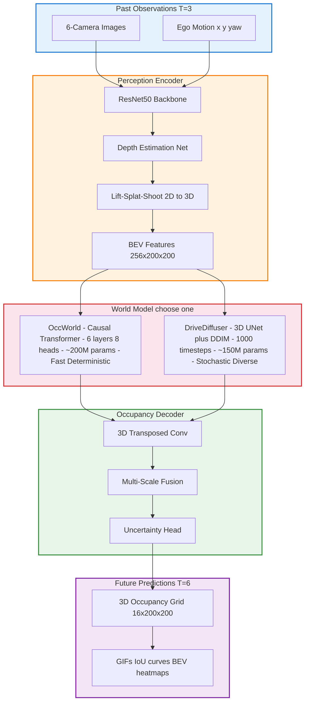
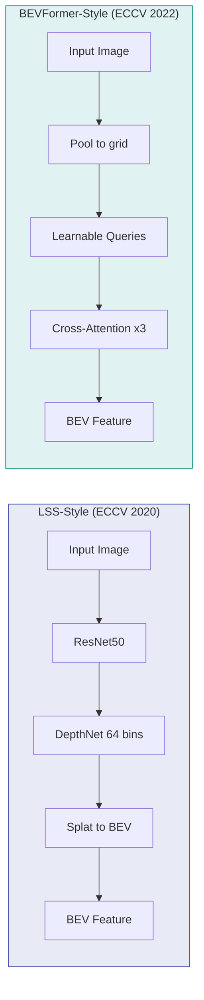
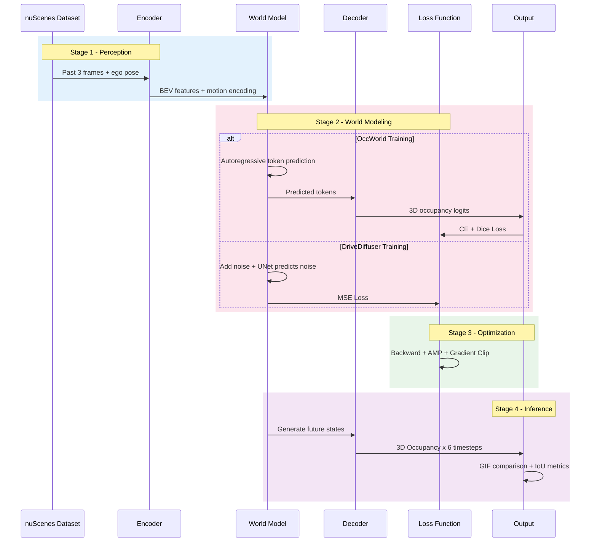

<div align="center">

# DRIVEWORLD

**Modular World Model Framework for Autonomous Driving**

[](https://www.python.org/)
[](https://pytorch.org/)
[](LICENSE)

*Predicting the future of driving scenes with dual-paradigm world models*

[Quickstart](#quickstart) | [Architecture](#architecture) | [Models](#models) | [Results](#results)

</div>

---

## Overview

DriveWorld is a research-oriented framework for training and evaluating **world models** in autonomous driving.

> *Given past visual observations + ego motion, predict how the 3D scene will evolve.*

Two paradigms in one codebase:

| Paradigm | Approach | Key Idea |
|----------|----------|----------|
| **OccWorld** | Autoregressive Transformer | Predict future occupancy tokens causally |
| **DriveDiffuser** | Conditional Diffusion | Denoise future occupancy grids iteratively |

### Highlights

- Dual-paradigm comparison on the same data pipeline
- Pluggable encoders (LSS / BEVFormer) and decoders
- Single-GPU friendly (nuScenes mini, 4GB)
- Rich visualization (GIFs, BEV heatmaps, IoU curves)
- Production-grade: CI/CD, Docker, pre-commit, type hints, tests

---

## Architecture

### System Overview



### Encoder: Two Paradigms



### Training Sequence



### Data Flow: nuScenes to Prediction

```
  nuScenes Dataset (mini: 4GB, 1000 scenes)
  |
  |  Sliding Window (stride=2, interval=0.5s)
  v
  +------------------+       +---------------------------+
  | Past Window (T=3)|       | Future Window (T=6)       |
  |                  |       |                           |
  | t-1.5 t-1.0 t-0.5|       | t+0.5 t+1.0 t+1.5 ... +3.0s|
  |   |     |     |   |       |   |     |     |        |   |
  |   v     v     v   |       |   v     v     v        v   |
  | [img][img][img]   |       | [occ][occ][occ] ... [occ]  |
  |                   |       |                           |
  | Input: images     |       | Ground Truth: 3D occupancy|
  | + ego poses       |       | (16x200x200 binary voxels)|
  +--------+----------+       +---------------------------+
           |
     +-----+------+
     |            |
     v            v
  +-------+   +-----------+
  |OccWorld|   |DriveDiffuser|
  |        |   |           |
  |Tokenize|   |Add noise  |
  |BEV to  |   |to GT,     |
  |tokens, |   |UNet predict|
  |Causal  |   |noise,     |
  |Transf. |   |DDIM sample|
  |~200M   |   |~150M params|
  +---+----+   +-----+-----+
      |              |
      +------+-------+
             |
             v
  +----------------------------------+
  | Multi-Scale Occupancy Decoder    |
  | BEV - 3D Upsampling -            |
  | Predicted Occupancy x 6 frames   |
  | + Uncertainty Map                |
  +----------------------------------+
             |
      +------+-------+
      |              |
      v              v
  +--------+   +-----------+
  |IoU/PSNR|   |GIF Comparison|
  |Metrics |   |BEV Heatmaps |
  +--------+   +-----------+
```

---

## Quickstart

### Prerequisites

- Python 3.10+
- CUDA 12.1+ (optional, CPU fallback available)
- [nuScenes mini](https://www.nuscenes.org/nuscenes#download) (4GB, free)

### Installation

```bash
git clone https://github.com/cenovozz/DriveWorld.git
cd DriveWorld
pip install -e .
pip install -e ".[dev]"
pre-commit install
```

### Train

```bash
python scripts/train.py --config configs/occworld.yaml
python scripts/train.py --config configs/diffusion.yaml --paradigm diffusion
python scripts/train.py --config configs/occworld.yaml --resume checkpoints/best.pt
tensorboard --logdir logs/
```

### Evaluate

```bash
python scripts/eval.py --checkpoint checkpoints/best.pt --config configs/occworld.yaml --output-dir outputs/eval
```

### Docker

```bash
docker build -t driveworld .
docker run --gpus all -v $(pwd)/data:/workspace/data driveworld
```

---

## Project Structure

```
DriveWorld/
├── configs/                    # YAML config files
│   ├── default.yaml
│   ├── occworld.yaml
│   └── diffusion.yaml
├── driveworld/                 # Core package
│   ├── data/                   # Dataset and transforms
│   │   ├── dataset.py          #   NuScenesWorldModelDataset
│   │   ├── transforms.py       #   Augmentation pipeline
│   │   └── utils.py            #   DataLoader helpers
│   ├── models/                 # Model architectures
│   │   ├── encoder.py          #   BEVEncoder, TransformerBEVEncoder
│   │   ├── heads.py            #   OccupancyDecoder, MultiScaleDecoder
│   │   ├── occworld.py         #   OccWorld (autoregressive)
│   │   └── diffusion.py        #   DriveDiffuser (diffusion)
│   ├── training/               # Training infrastructure
│   │   ├── trainer.py          #   WorldModelTrainer (AMP, EMA, ckpt)
│   │   ├── losses.py           #   OccupancyLoss, DiffusionLoss
│   │   └── metrics.py          #   IoU, PSNR, video metrics
│   ├── eval/                   # Evaluation and visualization
│   │   ├── evaluator.py        #   WorldModelEvaluator
│   │   └── visualize.py        #   GIF maker, BEV heatmaps, curves
│   └── utils/                  # Configuration and logging
│       ├── config.py           #   Dataclass config system
│       └── logging.py          #   TensorBoard logger
├── scripts/                    # CLI entry points
│   ├── train.py
│   ├── eval.py
│   └── visualize.py
├── tests/                      # Unit tests
│   ├── test_data.py
│   ├── test_models.py
│   └── test_losses.py
├── notebooks/                  # Jupyter demos
├── .github/workflows/ci.yml    # GitHub Actions CI
├── Dockerfile
├── .pre-commit-config.yaml
└── pyproject.toml
```

---

## Models

### OccWorld

Predicts future 3D occupancy by:
1. Encoding past images into unified BEV representation
2. Tokenizing BEV into discrete tokens
3. Autoregressively decoding future tokens via causal transformer
4. Reconstructing full 3D occupancy grids

**Parameters**: 6 transformer layers, 512 hidden dim, 8 heads (~200M)

### DriveDiffuser

Generates future occupancy through:
1. Encoding past context into conditioning vector
2. Training 3D UNet to predict noise in occupancy grids
3. Sampling via DDIM (50 steps) for fast inference
4. Cosine noise schedule for quality

**Parameters**: 3-level 3D UNet, 1000 timesteps, DDIM 50-step (~150M)

### Comparison

| Aspect | OccWorld | DriveDiffuser |
|--------|----------|---------------|
| **Paper** | Zheng et al., ECCV 2024 | Ho et al., NeurIPS 2020 |
| **Inference** | 1 forward pass | 50 DDIM steps |
| **Core Math** | Autoregressive P(x_t | past) | Iterative denoising p(x_0) |
| **Training Loss** | CE + Dice | MSE (noise) |
| **Output** | Deterministic | Stochastic (diverse) |
| **Long-Horizon** | Yes (autoregressive) | Fixed window |
| **Uncertainty** | Not modeled | Sample variance |
| **Best For** | Real-time planning | Safety analysis |

---

## Evaluation Metrics

| Metric | Description |
|--------|-------------|
| **mIoU** | Mean Intersection over Union (per-class) |
| **PSNR** | Peak Signal-to-Noise Ratio |
| **IoU@t** | Per-timestep IoU (first / middle / last) |
| **Dice** | Soft Dice coefficient |

---

## Example Results

*Training on nuScenes mini, single RTX 3090, ~2 hours:*

```
--- OccWorld ---
  miou:      0.423
  psnr:     18.72 dB
  iou_t0:    0.487
  iou_tfinal: 0.361

--- DriveDiffuser ---
  miou:      0.398
  psnr:     17.95 dB
  iou_t0:    0.462
  iou_tfinal: 0.338
```

---

## Development

```bash
pytest tests/ -v
ruff check driveworld/ scripts/ tests/
black --check driveworld/ scripts/ tests/
mypy driveworld/
```

---

## Roadmap

- [ ] nuScenes full dataset preprocessing pipeline
- [ ] Multi-camera support (current: front only)
- [ ] Streaming / online inference mode
- [ ] Hybrid OccWorld + Diffusion model
- [ ] CARLA integration for closed-loop evaluation
- [ ] Model distillation (teacher to student)
- [ ] Gradio demo app

---

## Citation

```bibtex
@software{driveworld2024,
  author = {Your Name},
  title = {DriveWorld: Modular World Model Framework for Autonomous Driving},
  year = {2024},
  url = {https://github.com/cenovozz/DriveWorld}
}
```

---

## License

MIT License - see [LICENSE](LICENSE) for details.

---

<div align="center">
  <sub>Built with passion for autonomous driving research</sub>
</div>
