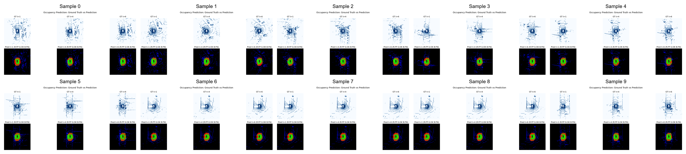
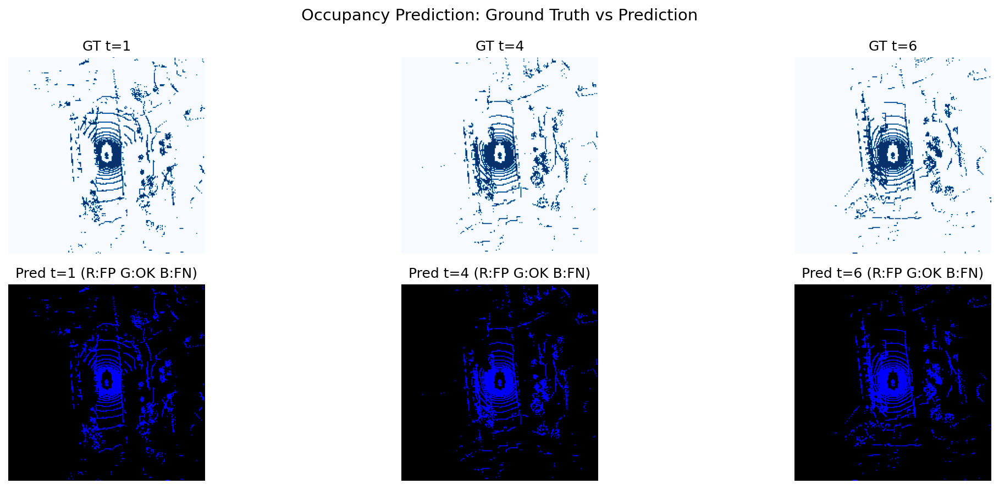

<div align="center">

# DriveWorld

**A Modular World-Model Framework for Autonomous Driving**

[](https://www.python.org/)
[](https://pytorch.org/)
[](LICENSE)

*Predicting the future of driving scenes from past observations and ego motion.*

[Overview](#overview) | [Quickstart](#quickstart) | [Models](#models) | [Project Structure](#project-structure)

</div>

---

## Overview

DriveWorld trains a **world model** for autonomous driving: given a short history of
front-camera images and ego poses, it predicts the future 3D occupancy of the scene.

Two paradigms share the same data pipeline and training loop:

| Paradigm | Approach | Key Idea |
|----------|----------|----------|
| **OccWorld** | Autoregressive Transformer | Predict future occupancy from compact BEV + motion tokens |
| **DriveDiffuser** | Conditional Diffusion | Denoise future occupancy grids iteratively |

### Highlights

- Unified nuScenes pipeline: raw sensor data -> compact `.npz` -> sliding windows
- Lightweight, single-GPU-friendly implementation (nuScenes mini, ~4 GB)
- OccWorld and DriveDiffuser are both end-to-end trainable and validated forward/backward
- Config-driven design (YAML + dataclasses) with AMP, checkpointing, and TensorBoard
- Evaluation metrics: mIoU, Dice, PSNR, per-timestep IoU

> Current status: OccWorld and DriveDiffuser are the two trainable paths.
> The full BEVFormer/LSS encoder variants are kept as research scaffolds.

---

## Quickstart

### Prerequisites

- Python 3.10+
- CUDA 12.x recommended; CPU fallback works for smoke tests
- nuScenes mini (free, ~4 GB)

### Install

```bash
git clone https://github.com/cenovozz/DriveWorld.git
cd DriveWorld
pip install -e .
```

### Prepare data

```bash
mkdir -p data/nuscenes && cd data/nuscenes
wget https://d36yt3mvayqw5m.cloudfront.net/public/v1.0/v1.0-mini.tgz
tar -xzf v1.0-mini.tgz
cd ../..
pip install nuscenes-devkit
python scripts/preprocess_nuscenes.py
```

### Train

```bash
python scripts/train.py --config configs/occworld.yaml
tensorboard --logdir logs/
```

### Evaluate

```bash
python scripts/eval.py --checkpoint checkpoints/occworld/best.pt \
  --config configs/occworld.yaml --output-dir outputs/eval
```

---

## Models

### OccWorld (v1, stable)

Pipeline:

1. **Encoder** (`ConvBEVEncoder`): a compact CNN encodes each past frame and pools
   them into a low-resolution BEV feature map (`bev_h x bev_w = 16 x 16`,
   `bev_feat_dim = 128`). The small grid keeps the transformer tractable.
2. **World model**: the BEV map is flattened into tokens, concatenated with
   encoded ego-motion tokens, and processed by a transformer
   (`512` hidden dim, `6` layers, `8` heads).
3. **Decoder** (`OccupancyDecoder`): future tokens are projected back to a compact
   BEV, then upsampled with 2D transposed convolutions to the full output grid
   (`16 x 200 x 200` voxels per frame) and reshaped to 2-class occupancy logits.

- **Input**: `(T_past=3, 3, 224, 480)` front images + ego pose
- **Output**: `(T_future=6, 2, 16, 200, 200)` occupancy logits
- **Parameters**: ~36M (validated)
- **Loss**: cross-entropy + soft Dice

### DriveDiffuser

Generates future occupancy through conditional denoising:

1. **Representation**: future occupancy `(T_future, Z, H, W)` is flattened into
   `T_future * Z` channels and denoised as a 2D map.
2. **Backbone**: 2D UNet with FiLM conditioning and bottleneck attention.
3. **Conditioning**: past BEV features (spatial map) + ego motion (global vector).
4. **Sampling**: DDIM with 50 steps (configurable).

- **Input**: past images + ego pose + future ego trajectory
- **Output**: `(T_future, num_z, 200, 200)` occupancy in `[0, 1]`
- **Parameters**: ~49M (validated)
- **Loss**: MSE on predicted noise

### Encoders

- `ConvBEVEncoder`: default and validated (v1).
- `BEVEncoder` (LSS-style) and `TransformerBEVEncoder` (BEVFormer-style): included
  as research scaffolds, not enabled by default.

---

## Project Structure

```
DriveWorld/
|-- configs/                 # YAML configs (occworld / diffusion / default)
|-- driveworld/
|   |-- data/                # nuScenes dataset, transforms, dataloader
|   |-- models/              # encoder, heads, OccWorld, DriveDiffuser
|   |-- training/            # trainer, losses, metrics
|   |-- eval/                # evaluator and visualization
|   `-- utils/               # config and logging
|-- scripts/                 # train / eval / visualize / preprocess CLIs
|-- tests/                   # unit tests
|-- docs/                    # deployment and roadmap notes
|-- Dockerfile
`-- pyproject.toml
```

---

## Evaluation Metrics

| Metric | Description |
|--------|-------------|
| **mIoU** | Mean Intersection over Union (per-class) |
| **Dice** | Soft Dice coefficient |
| **PSNR** | Peak Signal-to-Noise Ratio |
| **IoU@t** | Per-timestep IoU (first / middle / last) |

## Results

### OccWorld (nuScenes mini)

The numbers below come from a single-GPU training run on **nuScenes mini** and are
reproducible with the commands in [Quickstart](#quickstart).

| Setting | Value |
|--------|-------|
| **Model** | OccWorld (autoregressive Transformer) |
| **Dataset** | nuScenes mini: 110 train / 99 val scenes |
| **Task** | 3 past frames + ego pose -> 6 future occupancy frames |
| **Output** | `16 x 200 x 200` voxels per timestep |
| **Parameters** | ~36M |
| **Training** | 1x GPU, 100 epochs |
| **val/mIoU** | **0.570** |
| **val/loss** | 0.461 |

Ground-truth vs. predicted BEV occupancy on the val split:



Reproduce:

```bash
python scripts/eval.py --checkpoint checkpoints/occworld/best.pt \
  --config configs/occworld.yaml --output-dir outputs/eval
```

### DriveDiffuser (nuScenes mini)

Diffusion-based world model from the same nuScenes mini setup. The checkpoint and
visualizations are from the training run recorded in `logs/diffusion/`.

| Setting | Value |
|--------|-------|
| **Model** | DriveDiffuser (DDPM-style diffusion world model) |
| **Dataset** | nuScenes mini: 110 train / 99 val scenes |
| **Task** | 3 past frames + ego pose -> 6 future occupancy frames |
| **Diffusion** | 1000 cosine-schedule timesteps, UNet `[128, 256, 512]` |
| **Training** | 1x GPU, 150 epochs |
| **train/loss_epoch** | 0.091 (epoch 149) |
| **best val/loss** | 0.089 (epoch 136) |
| **last val/loss** | 0.108 (epoch 149) |

Ground-truth vs. predicted BEV occupancy on the val split:



Reproduce:

```bash
python scripts/eval.py --checkpoint checkpoints/diffusion/best.pt \
  --config configs/diffusion.yaml --output-dir outputs/eval_diffusion
```

---

## Roadmap

- [ ] Full nuScenes trainval preprocessing
- [ ] Multi-camera support (current: front camera only)
- [ ] Add classifier-free guidance for DriveDiffuser
- [ ] Hybrid OccWorld + Diffusion model
- [ ] Closed-loop evaluation in CARLA
- [ ] Gradio demo app

---

## Citation

```bibtex
@misc{driveworld2024,
  author = {cenovozz},
  title = {DriveWorld: A Modular World-Model Framework for Autonomous Driving},
  year = {2024},
  url = {https://github.com/cenovozz/DriveWorld}
}
```

---

## License

MIT License - see [LICENSE](LICENSE) for details.
